Semantic UI是什麼?  
=================
*	一個前端開發的framework 
*	使RWD(Responsive Web Design)自適應網頁開發變得方便
*	RWD簡單說是設計在各種裝置上適合瀏覽的網頁  

Semantic UI的優點
=====================

1.好用的Grid system
--------------
* grid system 將一列區分為16個欄位共16等份
* 宣告不同的class達到不同的寬度與排列效果
* 宣告的class名稱可依需求作微調
 
	* 宣告方式
	
			

			

			

			

			

			

		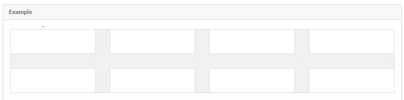
		
		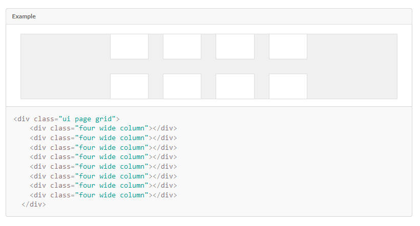
		
		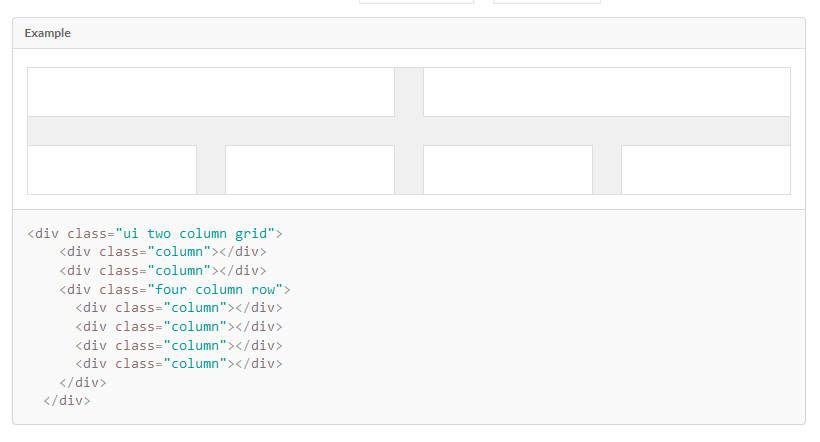

	* Grid樣式
		* Divided Grid
			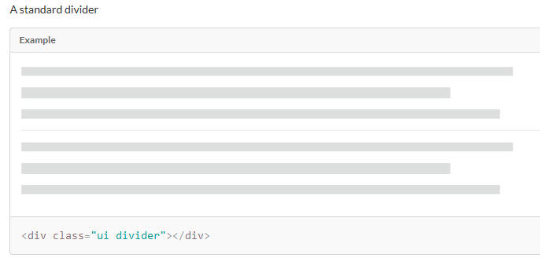
		* Vertically Divided Grid
			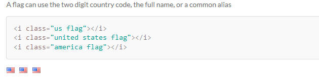
		* Celled Grid
			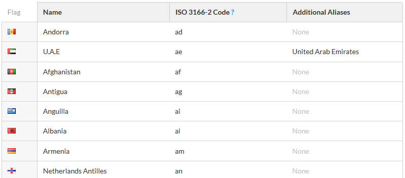
		* Internally Celled Grid
			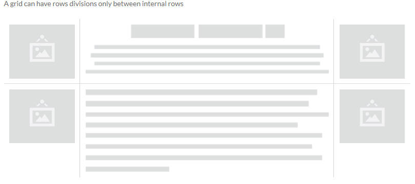

2.Tag套用樣式限制少並簡潔
--------------
*   button
	
	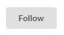
*   label

	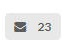
*   list

	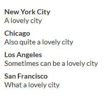

與Bootstrap的差異
=====================
1.	grid system
	* 欄位數
		* grid system 將一列區分為12個欄位共12等份,  
		* 用不同的prefix class配上不同數字達到不同的寬度與排列效果	
		* 不同名稱的prefix class對應不同的裝置
		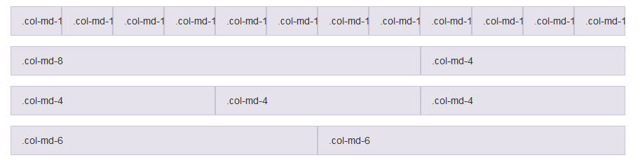
	* 宣告方式
	 
			

				...
			
	
			

			  ...
			

		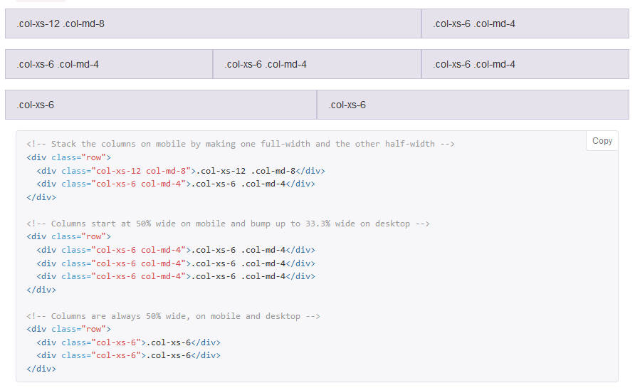
			
	* Grid樣式:無

	* 其他特色:
		* Nestable
		
			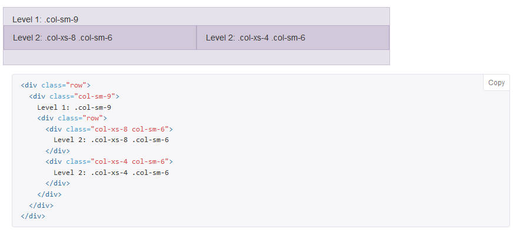
			
			* 用Semantic UI實現相同效果
			
					

						

							Level1: 12 column
							

								

									Level2: 11 column
								

								

									Level2: 5 column
								

							

						

					

		* Offsets

			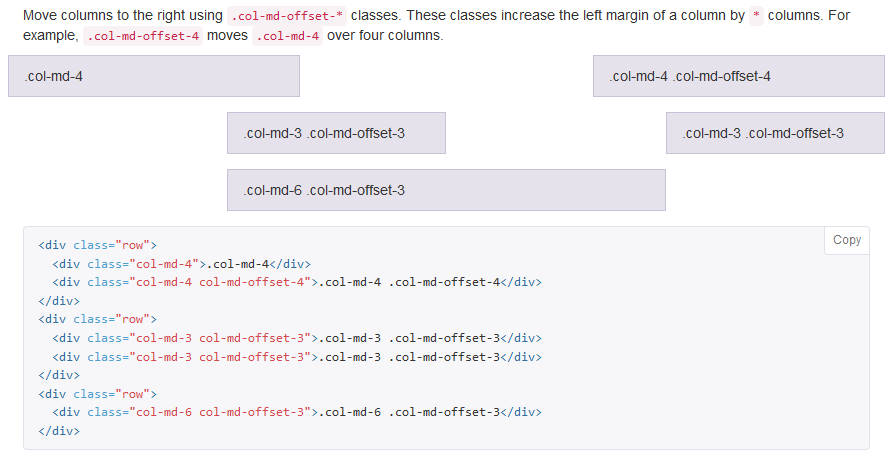

			* 用Semantic UI實現相同效果
			
					

						

							four wide column
						
	
						

						
						

						

							four wide column
						

					

		* Column ordering
		 
			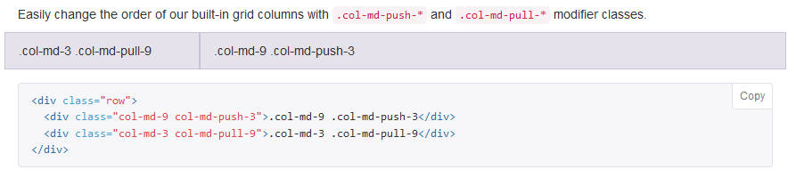
			
			* 用Semantic UI實現相同效果
			
					

						

							twelve wide column
						
	
						

							four wide column
						

					

	
2. Tag套用樣式
	*   button
		
		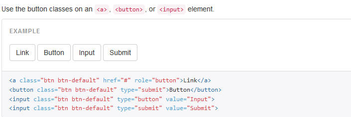
	*   label
	
		
	*   list
	
		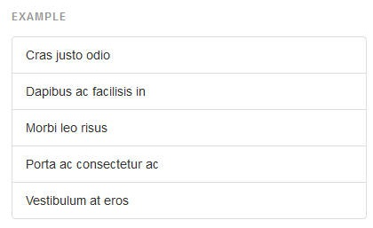
	

Friday首頁 RWD試作
=====================
* 電腦
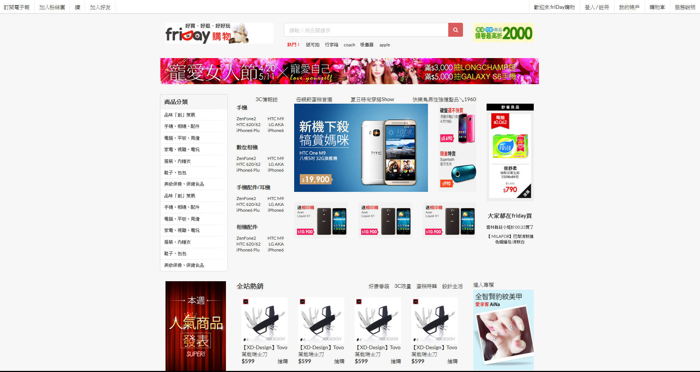
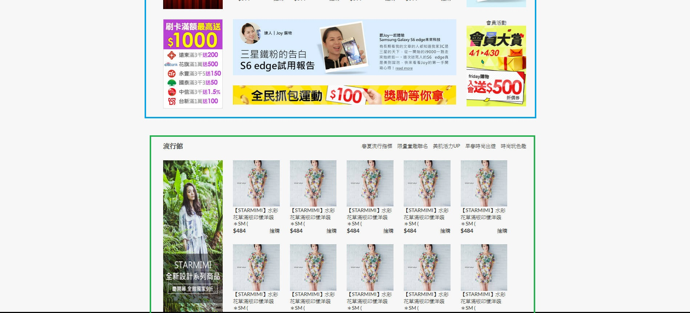

* Sidebar Menu
	* 手機
	
	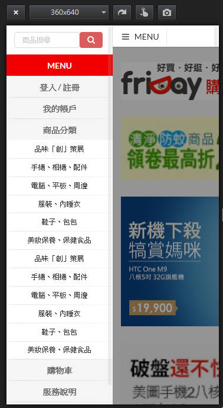

		

		<a class="item">
			

				<input placeholder="商品搜尋" type="text" style="width:30px;">
					<button class="ui red icon button">
						<i class="search icon"></i>
					</button>
			

		</a>

		<a class="header item" style="background-color:#F00000;color:white;">
		MENU
		</a>
		.......
		<a class="header item" >
	        商品分類
	      </a>
			

			 <a class="item">
				品味「創」策展
			 </a>
			  .....
			

		.......
		

		

			//page content
		

* Menu hide
	* 平版
	
	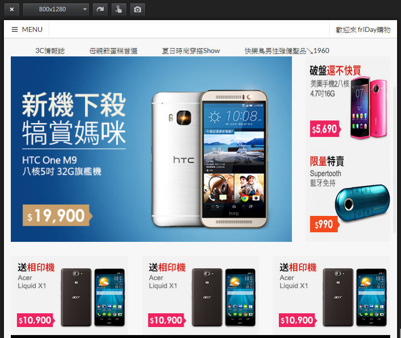
	
		

			

			  <a class="header item"><h4 class="center aligned">商品分類</h4></a>
			  <a class="item">品味「創」策展</a>
			  ........
			

		

* Column wide set
	* 平版
	
	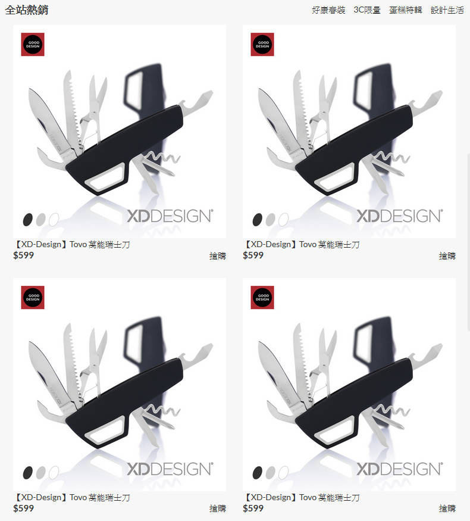
	* 手機

	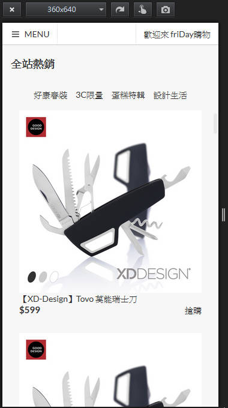

		

			

				
				
【XD-Design】Tovo 萬能瑞士刀 

				
<h4>$599</h4>

				
搶購
					
			

			..................
		
		

* AD不同裝置設定
	* 平版
	
	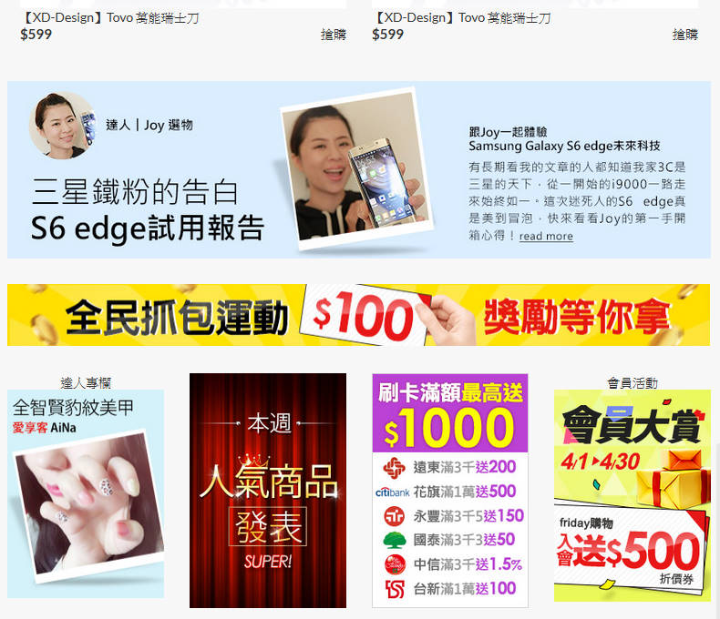
	
		<!--computer only-->
			

				
會員活動

				

					
				

			

			
		<!--tablet only-->
			

				

					
達人專欄

					

						
					

				

				

					

						
					

				

				

					

						
					

				

				

					
會員活動

					

						
					

				

				

		<!--mobile only-->
				

					
達人專欄

					

						
					

				

				

					

						
					

				

				

					

						
					

				

				

					
會員活動

					

						
					

				

				

		<!---->

* equal height stretched row
	* 電腦
	
	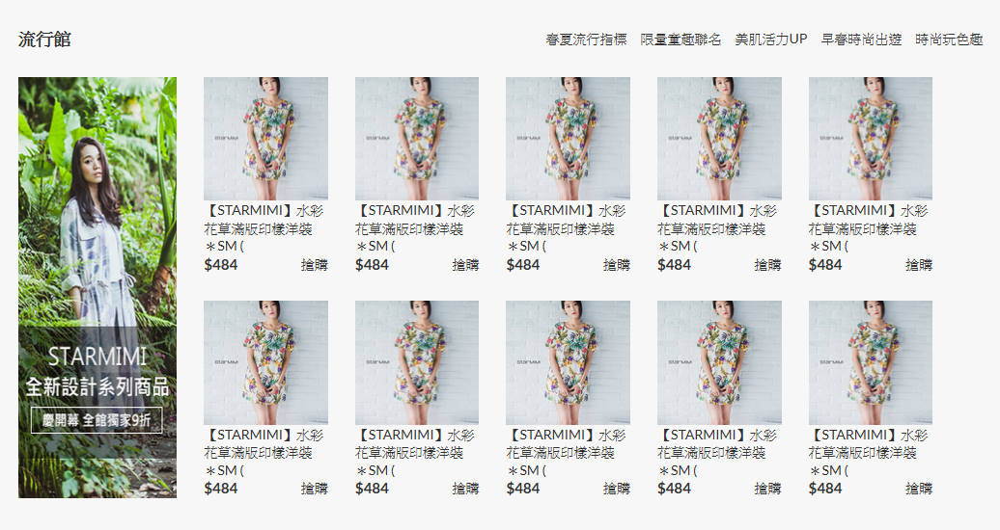
	* 平版
	
	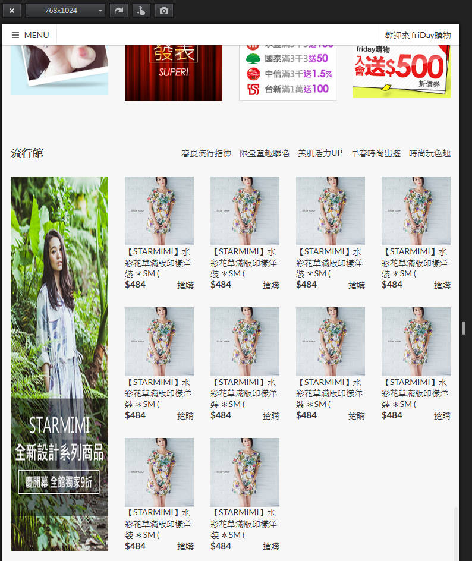

		

			

				
			

					
			

				

					

						
						
【STARMIMI】水彩花草滿版印樣洋裝 ＊SM (

						
<h4>$484</h4>

						
搶購

					

					...................	  		
				

			

		
