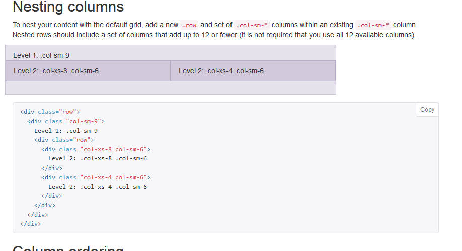

bootstrap是什麼?  
===============
*	一個前端開發的framework 
*	使RWD(Responsive Web Design)自適應網頁開發變得方便
*	RWD簡單說是設計在各種裝置上適合瀏覽的網頁  
    
如何使用bootstrap?
=================

1.include
----------
	<!DOCTYPE html>   
	<html lang="en">
	<head>
	    <meta charset="utf-8">
	    <meta http-equiv="X-UA-Compatible" content="IE=edge">   
	    <meta name="viewport" content="width=device-width, initial-scale=1">
	    <!-- The above 3 meta tags *must* come first in the head; any other head content must come *after* these tags -->

		<!-- Latest compiled and minified CSS -->
		<link rel="stylesheet" href="https://maxcdn.bootstrapcdn.com/bootstrap/3.3.4/css/bootstrap.min.css">

		<!-- Optional theme -->
		<link rel="stylesheet" href="https://maxcdn.bootstrapcdn.com/bootstrap/3.3.4/css/bootstrap-theme.min.css">

		<!-- Latest compiled and minified JavaScript -->
		
	</head>

2.grid system
--------------

首先必需先提一下container:

	

	  ...
	

	
	

	  ...
	

grid system 將一列區分為12個欄位共12等份,  

用不同的prefix class配上不同數字達到不同的寬度與排列效果	

不同名稱的prefix class對應不同的裝置   

  

*	Offsets:
		與左邊欄位,留白n個欄位的空白,若超過最大值的12欄,則會擠到下一列
*	Nestable:
		支援多層結構,一個DIV底下可以有第二層第三層或更多層結構,毎層都可再區分12等份
*	Column ordering:
		借由.col-md-push-* and .col-md-pull-* 的class 實現推拉DIV位置的功能

   

3.Forms
-------
1.basic

*	form-control

*	form-group

2.Horizontal form

*	form-horizontal

*	control-label
	

3.Validation states

*	.has-warning

*	.has-error

*	.has-success

*	.has-feedback
   
Why bootstrap?
=============

1.容易建置及開始使用
 
2.強大的Grid system
 
3.提供多數HTML元素設計 

4.豐富的元件

*    Dropdowns
*    Button Groups
*    Navigation Bar
*    Breadcrumbs
*    Labels & Badges
*    Alerts
*    Progress Bar
*    And others.

5.詳細的官方文件

